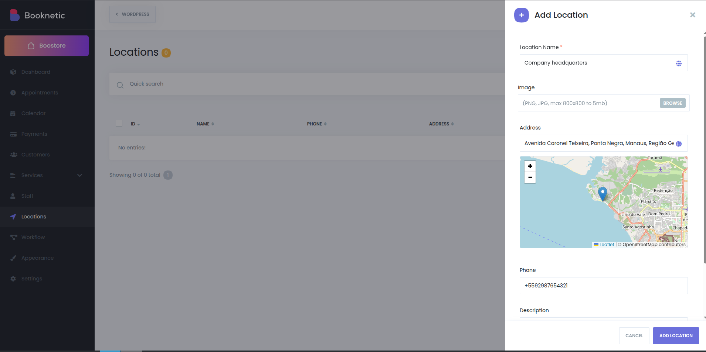

# Booknetic Extras

A WordPress plugin that enhances Booknetic by replacing Google Maps with OpenStreetMap, offering a privacy-focused and open-source mapping solution for your booking system.

> **IMPORTANT**: This is an unofficial complement for Booknetic. 
> Requires an active installation of [Booknetic](https://www.booknetic.com/).
> Not affiliated, endorsed or sponsored by FS-Code.

## 🌟 Key Features

- 🗺️ **OpenStreetMap Integration** - Replaces Google Maps with the open-source OpenStreetMap
- 🔒 **No API Key Required** - Eliminates the need for Google Maps API keys
- ⚡ **Lightweight & Fast** - Uses efficient Leaflet.js for smooth performance
- 🛠️ **Seamless Integration** - Works out of the box with Booknetic's interface
- 🌍 **Global Coverage** - Access to worldwide mapping data without restrictions

## 🚀 Why Choose This Plugin?

- **Privacy-First**: No tracking or data collection by Google
- **Cost-Effective**: No API usage fees or usage limits
- **Open Source**: Built on open technologies like OpenStreetMap and Leaflet.js
- **Easy Setup**: Install, activate, and it just works!

Perfect for Booknetic users who want to remove Google dependencies while maintaining full mapping functionality for their booking system.

## Requirements

- WordPress 5.0 or higher
- PHP 8.2 or higher
- Booknetic Appointment Booking Plugin

## Installation

1. Upload the `booknetic-extras` folder to the `/wp-content/plugins/` directory
2. Activate the plugin through the 'Plugins' menu in WordPress
3. That's it! The plugin will automatically replace Google Maps with OpenStreetMap

## How It Works

- Removes Google Maps scripts from the Booknetic admin interface
- Injects Leaflet.js and OpenStreetMap assets
- Maintains all original functionality while using open-source mapping

## Support

For support, please open an issue on [GitHub](https://github.com/dansp89/booknetic-extras/issues).

## License

This plugin is licensed under the MIT License. See the [LICENSE](LICENSE) file for more details.

## Changelog

### 1.0.0
* Initial release
* Replaced Google Maps with OpenStreetMap
* Added mu-plugin for automatic script replacement